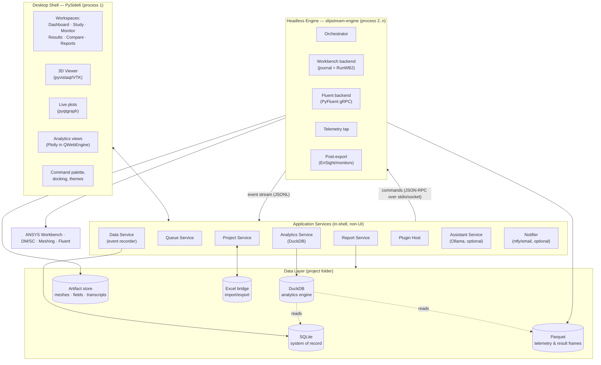
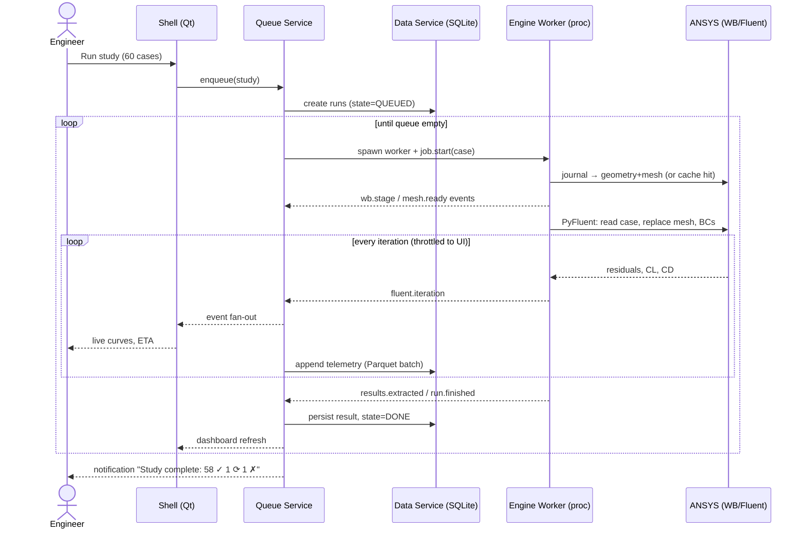
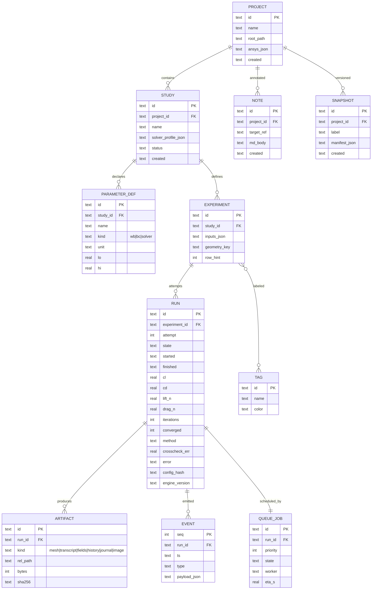
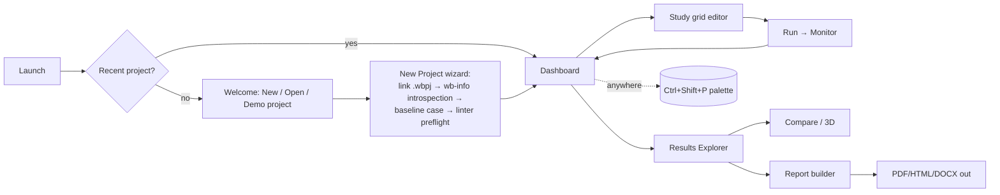

# SLIPSTREAM — Master Software Design Blueprint

**A local-first, open-source desktop platform for automated CFD studies**
*From `cfdauto` (working automation engine) to a professional engineering application*

| | |
|---|---|
| Document type | Master architecture specification |
| Planning horizon | 6–12 months (versions 0.9 → 3.x), with 4.x outlook |
| Baseline | `wing_aoa_automation/` — working end-to-end (WB journal + PyFluent, Excel ledger, resume, mesh cache, mock mode, 8 passing tests, one full sweep completed on ANSYS Student 2026 R1) |
| Product working title | **Slipstream** (placeholder — alternatives: AeroDeck, WingLab, FlowPilot) |
| Guiding constraint | 100% free · 100% local · open-source stack · no vendor lock-in · student-runnable from a `git clone` |

### How this document maps to the requested outputs

| # | Requested output | Section |
|---|---|---|
| 1 | Product Vision | §1 |
| 2 | Product Philosophy | §2 |
| 3 | Long-term Vision | §3 |
| 4 | Feature Matrix | §5 |
| 5 | Software Architecture | §6 |
| 6 | Folder Structure | §7 |
| 7 | GUI Wireframes | §9 |
| 8 | Module Breakdown | §11 |
| 9 | Database Design | §8 |
| 10 | Technology Stack | §10 |
| 11 | Engineering Workflow | §4 |
| 12 | Data Flow | §6.6 |
| 13 | UI Flow | §9.6 |
| 14–15 | Feature / Multi-version Roadmap | §13 |
| 16 | AI Roadmap | §12.7, §13 (v3.0) |
| 17 | HPC Roadmap | §14 |
| 18 | Plugin Ecosystem | §15 |
| 19 | Future Enterprise Roadmap | §16 |
| 20 | Development Timeline | §13.9 |
| 21 | Risk Analysis | §17 |
| 22 | Technical Debt Strategy | §18.1 |
| 23 | Scalability Strategy | §18.2 |
| 24 | Maintainability Strategy | §18.3 |
| 25 | Extensibility Strategy | §18.4 |
| 26 | Ideas beyond imagination | §19 |
| — | Licensing & OSS compliance (constraint-driven) | §20 |
| — | Bridge plan: today's repo → v0.9 | §21 |

---

# PART I — VISION

## 1. Product Vision

**Slipstream is the missing workbench between ANSYS and the engineer's brain.**

ANSYS gives you a solver. Excel gives you a table. Between them sits everything that actually consumes an engineer's week: setting up dozens of parameter combinations, babysitting overnight runs, hunting through folders for the transcript of the case that diverged, copying numbers into spreadsheets, rebuilding the same L/D plot for the fifth time, and writing the report by hand.

Slipstream owns that middle layer. It is:

- **A campaign manager** — define a study (parameters × values), press Run, walk away. Every case is queued, executed, monitored, retried, and recorded. Resume after any crash is a core guarantee, not a feature.
- **A flight recorder** — every run stores its full provenance: the exact journal, the exact config, the solver transcript, the iteration-by-iteration force history, versions of everything. Any result can be explained, reproduced, or diffed six months later.
- **An analysis cockpit** — the moment data lands, it is queryable: polars, drag polars, L/D maps, sensitivity rankings, outlier flags, side-by-side comparisons, and one-click professional reports.
- **A teaching-grade tool** — a student can clone it from GitHub, `pip install`, point it at ANSYS Student, and run a publication-quality parametric study on a laptop.

The one-sentence pitch: **"SimScale's workflow ergonomics, running 100% locally on your own ANSYS license, free and open source."**

### What Slipstream is *not*

- Not a solver. ANSYS Fluent remains the physics engine (with the architecture leaving the door open for OpenFOAM/SU2 backends later — see §15).
- Not a cloud service. Everything runs on the user's machine; the network is optional (LAN workers, notifications) and never required.
- Not a CAD tool. Geometry parameterization stays in DesignModeler/SpaceClaim; Slipstream drives parameters, it doesn't model.

### Expected end result (12 months)

A single installable desktop application where an engineer creates a project, imports/links a Workbench setup, defines a parameter study in a table view, watches live residual and force curves as the queue burns through cases overnight, explores results in an interactive 3D viewer and analytics dashboard the next morning, and exports a PDF report — without opening a terminal once. The same engine remains fully scriptable from the CLI for power users and CI.

---

## 2. Product Philosophy

Eight principles, in priority order. When two conflict, the earlier one wins.

**P1 — The engine is the product; the GUI is a client.**
Everything the GUI can do must be doable headless. The current `cfdauto` package *is* the engine and survives intact as `slipstream.core`. The GUI never contains business logic; it renders state and sends commands. This is what makes the CLI, a future web dashboard, and CI automation free.

**P2 — Local-first, forever.**
No account. No telemetry. No required internet. All data in human-inspectable files (SQLite, Parquet, JSON, PNG) inside the project folder. A project folder zipped and emailed to a colleague opens on their machine.

**P3 — Never lose a result.**
The current framework's discipline (result.json before Excel, atomic saves, recovery CSV, resume ledger) is promoted to a platform invariant: every state transition is durable before it is displayed.

**P4 — Provenance over convenience.**
Every run records *exactly* what produced it. If a number cannot be traced to a solver transcript and a config hash, it doesn't belong in a report.

**P5 — Respect the engineer's existing tools.**
Excel is not the enemy — it becomes a first-class import/export bridge (round-trip, forever). ANSYS interactive setup remains where physics is defined; Slipstream never reverse-engineers what the GUI does better.

**P6 — Graceful degradation.**
No GPU → software-rendered 3D. No Ollama → AI panel hidden, everything else identical. No ANSYS → mock mode still demonstrates the entire workflow. Student license → the queue and physics linter *know* the 4-core/1M-cell limits and plan around them.

**P7 — Boring technology at the core, ambition at the edges.**
SQLite, Qt, VTK, Parquet — twenty-year technologies own the foundations. Experiments (LLMs, surrogates, distributed workers) live behind plugin/service boundaries where they can fail without harming the core.

**P8 — Built to be read.**
This is portfolio-grade and community-facing software: typed Python, documented decisions (ADRs), tested behavior, MkDocs site. The codebase itself is a deliverable.

---

## 3. Long-Term Vision (the 3-year picture)

```
Year 0 (today)      cfdauto CLI — one study type, Excel ledger, terminal logs
Year 1  v1.x–v2.x   Slipstream Desktop — projects, queue, live monitoring,
                    3D post-processing, analytics, reports. Single machine.
Year 2  v3.x        The assisted lab — local AI copilot, surrogate-guided DOE,
                    LAN worker pool, web read-only dashboard, plugin ecosystem
Year 3  v4.x        The open platform — multi-solver backends (OpenFOAM),
                    team sync, validated benchmark library, community plugin
                    marketplace, optional enterprise layer (auth, PostgreSQL)
```

The strategic bet: commercial CFD front-ends are either vendor-locked (Workbench), cloud-subscription (SimScale), or five-figure licenses (STAR-CCM+). There is a durable niche — students, researchers, small consultancies — for a *local, free, solver-agnostic study manager*. Slipstream targets that niche first with the ANSYS backend it already has working, and grows outward.

---

## 4. Engineering Workflow (a day in the life)

**Monday 17:40 — define.** Priya opens Slipstream, hits `Ctrl+Shift+P` → "New Study from Template" → picks *Flap sweep*. The parameter grid editor shows AOA, Alpha, Beta, Velocity columns (these came from `wb-info` introspection when the project was linked). She sets Beta = 3…8 step 1, Velocity = 10…100 step 10, AOA=5, Alpha=7 → the matrix preview says *60 experiments, 6 unique geometries, est. 14 h 20 m on this machine (history-based)*. The **physics linter** flags one row amber: *V=100 m/s → Mach 0.29, upper edge of incompressible validity* — she acknowledges it. Run.

**Monday 17:42 — leave.** The queue panel shows case 1 meshing. She enables "notify when done" (local ntfy push to her phone) and goes home. At 23:10 her phone buzzes: *Case 31 diverged (CL non-finite at iter 240) — auto-retry with lower relaxation queued.* She ignores it; the queue continues.

**Tuesday 08:30 — explore.** Dashboard: 58 ✓, 1 ⟳ retried-and-passed, 1 ✗ (Beta=8, V=100 — meshing failed at the flap gap; full forensics one click away). She opens **Results Explorer**, drags Beta to X, `L/D` to Y, Velocity to color → the interactive polar appears; hovering any point shows its convergence sparkline. She lassos the Beta=6 ridge, right-click → *Compare selected* → side-by-side pressure contours (from the auto-exported EnSight fields) with a difference view.

**Tuesday 09:15 — report.** *Report → Standard Study Report*: cover page, parameter table, convergence appendix, the four headline charts, contour plates for min/max L/D cases, and the provenance appendix (config hash, solver build, mesh stats). PDF lands in the project's `reports/`. She drags it into the team chat. Total human time: ~20 minutes.

Every step above maps to a concrete subsystem specified in Part III.

---

## 5. Feature Matrix

Legend: ✅ exists today (in cfdauto) · 🔨 vNext (v0.9–v1.0) · 🖥 v1.5 · 🏗 v2.x · 🔮 v3.x+

| Domain | Capability | Status |
|---|---|---|
| **Execution** | Excel-driven batch, resume, retries, mesh cache, mock mode | ✅ |
| | Event protocol (structured run telemetry stream) | 🔨 |
| | SQLite run ledger (Excel becomes bridge) | 🔨 |
| | Queue: pause/resume/cancel/priority/reorder, ETA | 🖥/🏗 |
| | Multi-worker (n Fluent sessions), license-aware gate | 🏗 |
| | Remote LAN worker over SSH; SLURM adapter | 🔮 |
| **Live monitoring** | Chunked CL/CD convergence check | ✅ |
| | Per-iteration residual + force streaming to UI | 🖥 |
| | Divergence prediction, ETA per case, solver speed | 🏗 |
| | Iteration replay from stored telemetry | 🏗 |
| **Geometry/Mesh** | WB parameter drive, geometry+mesh regen, `WBP:` extension columns | ✅ |
| | Mesh preview (3D), mesh quality stats & heatmap | 🏗 |
| | Mesh-independence wizard (GCI/Richardson) | 🏗 |
| **Solver** | Baseline-case physics, per-case BC/reference values, force-based convergence | ✅ |
| | Physics linter (pre-flight checks: Mach, y+ estimate, domain size, ref-area sanity) | 🔨/🏗 |
| | Per-row solver overrides (relaxation, iterations) | 🏗 |
| | Multi-baseline (turbulence-model column) | 🏗 |
| **3D Visualization** | Field export pipeline (EnSight Gold from Fluent) | 🔨 |
| | Interactive viewer: contours, slices, streamlines, vectors, clip, camera bookmarks | 🏗 |
| | Case A/B compare: side-by-side, overlay, difference field | 🏗 |
| | Screenshot/GIF/turntable export | 🏗 |
| **Analytics** | CL/CD/L/D per case in ledger | ✅ |
| | DuckDB analytics: pivot, filter, group, rank | 🏗 |
| | Interactive charts (polar, heatmap, parallel-coords, correlation matrix, surface) | 🏗 |
| | Statistics: distributions, CI, outliers (IQR/z), regression, Sobol sensitivity | 🏗 |
| | Live-updating dashboard during batch | 🏗 |
| **Projects** | Config-per-study, per-case artifact dirs | ✅ |
| | Project format (.slipstream folder), explorer tree, tags, notes, snapshots, templates, search | 🖥/🏗 |
| **Reporting** | — | |
| | HTML report (Jinja2 + Plotly) | 🔨 |
| | PDF (WeasyPrint), Word (python-docx), cover/TOC/appendix, logo, revision table | 🏗 |
| **AI (local)** | NL query over results (text→SQL, read-only) | 🔮 |
| | Convergence-failure explainer (rules engine + LLM narration) | 🔮 |
| | Surrogate model + next-point suggestion (GP/EI) | 🔮 |
| | RAG assistant over project notes/docs | 🔮 |
| **Platform** | CLI (`run/wb-info/init-template`) | ✅ |
| | Plugin API (backends, panels, analyses, exporters) | 🏗 |
| | Command palette, dockable layout, themes, shortcuts | 🖥 |
| | Web read-only dashboard (FastAPI, optional) | 🔮 |
| | Excel round-trip bridge (import study / export results) | 🔨 forever |

---

# PART II — ARCHITECTURE

## 6. Software Architecture

### 6.1 Architectural principles

1. **Engine/Shell separation with a process boundary.** The engine (today's `cfdauto`) runs in its *own OS process*, launched by the shell. Rationale: (a) a Fluent/WB crash can never take the GUI down; (b) the GUI event loop is never blocked by gRPC calls; (c) the engine remains a standalone CLI product; (d) the same wire protocol later serves LAN workers and the web dashboard for free.
2. **Everything observable is an event.** The engine emits a typed, versioned event stream (JSON Lines). The GUI, the database recorder, the notifier, and the future web dashboard are all just *subscribers*. This is the single most important new abstraction in the whole blueprint.
3. **One writer per store.** SQLite is written only by the Data Service (which subscribes to events); the engine writes only its per-case artifact files. No lock fights.
4. **Ports & adapters (already in place).** `MeshBackend` / `SolverBackend` protocols stay the seam for mocks, future OpenFOAM, and remote workers.
5. **UI = f(state).** Panels render from an in-memory store hydrated by events + DB queries; user actions dispatch commands. (The Qt equivalent of the Redux mental model, kept lightweight.)

### 6.2 Layered / component diagram



### 6.3 Process & threading model

| Process | Contents | Threads |
|---|---|---|
| **Shell** (1) | Qt event loop, all panels, services | Main (UI) + QThread pool for DB/DuckDB queries + QWebEngine's own |
| **Engine worker** (1 per running case; pool size configurable, default 1 on Student) | Orchestrator slice for one job: WB subprocess, PyFluent session, telemetry tap | Main + tap thread tailing report files |
| **Ollama** (optional, external) | Local LLM server | — |

Commands shell→engine: `job.start`, `job.pause` (graceful: finish current chunk, hold), `job.cancel`, `job.telemetry_rate`, `engine.ping`. Transport: newline-delimited JSON-RPC over the worker's stdin; events return on stdout. Chosen over sockets for v1 because it is zero-config and firewall-proof; the transport is abstracted so a TCP/WebSocket variant drops in for remote workers (§14).

### 6.4 The Event Protocol (keystone spec)

Versioned, append-only vocabulary. Every event: `{"v":1,"ts":"…","run_id":"…","type":"…", …payload}`.

| Event type | Payload (abridged) | Consumers |
|---|---|---|
| `job.queued / started / finished / failed / paused / cancelled` | job_id, experiment ref, reason | Queue panel, DB, notifier |
| `wb.stage` | stage ∈ {open, param_set, geometry, mesh, refresh, save}, message | Monitor timeline |
| `mesh.ready` | path, cells, cache_hit | Monitor, DB |
| `fluent.launched` | cores, precision, version | Monitor |
| `fluent.iteration` | it, residuals{cont,x,y,z,k,ω}, cl, cd, dt_s | Live plots (throttled), telemetry Parquet |
| `fluent.chunk` | it, cl, cd, flat_cl, flat_cd | Convergence widget |
| `run.converged / run.max_iters` | it | Monitor, DB |
| `results.extracted` | cl, cd, lift, drag, method(compute/fallback), crosscheck | DB, dashboard |
| `post.exported` | fields[], bytes, path | Viewer availability badge |
| `warn / error` | code, message, context | Log console, notifier |

Design rules: additive-only within a major version; unknown fields ignored; the DB recorder persists the raw stream to `runs/<id>/events.jsonl` *and* into normalized tables — which is what makes **iteration replay**, the web dashboard, and post-hoc debugging free.

### 6.5 Sequence — "Run study" end to end



### 6.6 Data flow diagram

```mermaid
flowchart LR
    XL[Excel study sheet] -- import --> ST[(study & experiments\nSQLite)]
    UI[Parameter grid editor] --> ST
    ST --> Q[queue_jobs]
    Q --> ENG[Engine worker]
    ENG -->|events.jsonl| EV[(event log)]
    ENG -->|telemetry| TP[(Parquet:\niterations)]
    ENG -->|artifacts| AR[(fs: mesh, transcript,\nEnSight fields, journal)]
    ENG -->|result| RS[(runs table)]
    RS & TP & ST --> DK{{DuckDB views}}
    DK --> DASH[Analytics dashboard]
    DK --> RPT[Report engine]
    RS -- export --> XL2[Excel results\n(round-trip)]
    AR --> V3D[3D viewer]
```

### 6.7 Domain class diagram (core)

```mermaid
classDiagram
    class Project { id; name; root_path; ansys_cfg; created }
    class Study { id; name; parameter_defs; solver_profile; status }
    class Experiment { id; inputs: dict; geometry_key(); case_id() }
    class Run { id; state; attempt; started; finished; result: CaseResult; artifacts[] }
    class CaseResult { cl; cd; lift_n; drag_n; iterations; converged; method }
    class QueueJob { priority; state; worker_id; eta }
    class MeshBackend { <<interface>> +prepare_mesh(exp, dir) Path }
    class SolverBackend { <<interface>> +run_case(exp, mesh, dir) CaseResult }
    class WorkbenchBackend; class FluentBackend
    class MockWB; class MockFluent
    class TelemetryTap { +stream() Iterator~Event~ }
    class EventBus { +publish(e); +subscribe(topic, fn) }

    Project "1" --> "*" Study
    Study "1" --> "*" Experiment
    Experiment "1" --> "*" Run
    Run "1" --> "1" CaseResult
    QueueJob "1" --> "1" Run
    MeshBackend <|.. WorkbenchBackend
    MeshBackend <|.. MockWB
    SolverBackend <|.. FluentBackend
    SolverBackend <|.. MockFluent
    FluentBackend --> TelemetryTap
    Run ..> EventBus : emits
```

---

## 7. Repository & Folder Structure

Monorepo, single installable distribution with optional extras. A student does: `git clone … && pip install -e ".[gui]" && slipstream`.

```
slipstream/
├── pyproject.toml                # extras: [gui] [viz] [ai] [web] [dev]
├── README.md · LICENSE (Apache-2.0) · CHANGELOG.md
├── docs/                         # MkDocs site (user guide + dev guide + ADRs)
│   └── adr/                      # Architecture Decision Records (0001-engine-shell-split.md …)
├── src/slipstream/
│   ├── core/                     # ← today's cfdauto, renamed; ZERO Qt imports
│   │   ├── models.py  aero.py  exceptions.py  config.py  logging_setup.py
│   │   ├── orchestrator.py  state.py
│   │   └── convergence.py        # extracted from fluent_controller (refactor, §21)
│   ├── backends/
│   │   ├── workbench/ (controller.py, journals/*.tpl)
│   │   ├── fluent/ (controller.py, adapters.py, telemetry.py, post_export.py)
│   │   └── mock/
│   ├── protocol/                 # event & command schemas (pydantic), versioned
│   ├── worker/                   # engine process entrypoint: stdio JSON-RPC loop
│   ├── data/                     # SQLite schema+migrations, repositories, Parquet IO,
│   │   └── excel_bridge.py       #   import/export ⇄ workbook (keeps user's format)
│   ├── services/                 # queue.py, projects.py, analytics.py (DuckDB),
│   │                             # reports.py, notify.py, assistant.py, plugin_host.py
│   ├── analytics/                # stats, sensitivity (SALib), outliers, regression
│   ├── reporting/                # jinja templates/, builders (html, pdf, docx)
│   ├── viz/                      # pyvista scenes, mesh quality, screenshot/gif export
│   ├── ui/                       # PySide6 only below this line
│   │   ├── app.py  main_window.py  theming/  widgets/
│   │   ├── panels/ (dashboard, study_grid, queue, monitor, results,
│   │   │           compare, viewer3d, logs, properties, notes)
│   │   ├── dialogs/  palette/  models_qt/   # Qt table models over repositories
│   │   └── resources/ (icons, qss themes)
│   ├── plugins_builtin/          # dogfooding the plugin API (csv exporter, xfoil import…)
│   └── cli.py                    # `slipstream run|gui|report|export|doctor`
├── plugins/                      # user drop-in directory (also entry-points)
├── tests/  (unit / integration-mock / ui-smoke via pytest-qt)
├── examples/ (demo project with recorded mock telemetry — runs with no ANSYS)
└── .github/workflows/ (lint+type+test matrix, docs deploy, release build)
```

Rules encoded in CI: `core/`, `backends/`, `protocol/`, `data/`, `services/`, `analytics/` **must not import** `PySide6` (import-linter contract). That is the engine/shell firewall.

---

## 8. Database Design

### 8.1 Store-by-role (polyglot, all embedded, all free)

| Role | Store | Why |
|---|---|---|
| System of record (projects, studies, experiments, runs, queue, tags, notes, events index) | **SQLite** (WAL mode) | Zero-admin, transactional, single file per project, 20-year stability, perfect for ≤10⁶ rows |
| Analytics engine | **DuckDB** | Columnar OLAP speed; queries SQLite tables *and* Parquet files in one SQL; Arrow-native → zero-copy to pandas/Plotly |
| High-volume series (iteration telemetry, monitor exports, result matrices) | **Parquet** (partitioned `runs/<id>/telemetry/*.parquet`) | Columnar, compressed, appendable in batches, readable by everything |
| Heavy binaries (meshes, EnSight fields, transcripts, images, journals) | **Filesystem artifact store** with content-addressed option | DBs are wrong for 100 MB blobs; index rows in SQLite point to relative paths |
| Human bridge | **Excel** via `excel_bridge` | Import a study sheet → experiments; export results back into the *user's own layout* (incl. the PDC-3676 sheet with Day/Test columns and formula cells left intact) |

### 8.2 Comparison (as requested)

| Option | Verdict | Pros | Cons |
|---|---|---|---|
| SQLite | ✅ record | serverless, ACID, ubiquitous, `sqlite-utils`/Datasette ecosystem | weak analytics on wide scans; single-writer (fine: one Data Service) |
| DuckDB | ✅ analytics | vectorized OLAP, reads Parquet/SQLite/Arrow directly, MIT | not a concurrent OLTP store — don't make it the record |
| Parquet | ✅ series | compression, columnar, language-agnostic | not queryable alone (that's DuckDB's job); immutable files → batch appends |
| PostgreSQL | 🔮 v4 option | multi-user, row-level security | server to run — violates local-first for core; offered only in enterprise layer |
| MongoDB | ❌ | — | schema-less hurts provenance; server; no benefit over SQLite+JSON columns |
| CSV | export only | universal | no types, no speed |
| Excel | bridge only | the user's habitat | locking, precision, not a database |
| Arrow | internal | zero-copy interchange between DuckDB↔pandas↔Plotly | in-memory format, not a store |

**Migration path:** v0.9 dual-writes (Excel + SQLite). v1.0 flips authority to SQLite with Excel as bridge. v4 offers `DATABASE_URL` for Postgres behind the same repository interfaces (SQLAlchemy Core), so nothing above the data layer changes.

### 8.3 Entity-relationship diagram



Design choices worth defending: **inputs as JSON** (parameter sets vary per study; `PARAMETER_DEF` gives typing/UI; DuckDB unnests JSON fine) with the four headline outputs **also as typed columns** on `RUN` for fast dashboards; `config_hash` + `engine_version` on every run = provenance backbone; `EVENT` mirrors the JSONL for queryable history while the raw file stays the audit source.

Indexes: `RUN(state)`, `RUN(experiment_id, attempt)`, `EVENT(run_id, seq)`, `EXPERIMENT(geometry_key)`; DuckDB gets read-only views `v_results` (study × inputs unpivoted × outputs) and `v_telemetry` (Parquet glob) that every chart and the AI text-to-SQL layer target.

---

## 9. UI / UX Design

### 9.1 Design language

- **Reference feel:** JetBrains' calm density + Fusion 360's viewport-first workspaces + Blender's editor-anywhere docking. Engineering software, not a web app: information-dense, keyboard-fast, zero decoration that doesn't inform.
- **Layout system:** Qt Advanced Docking System (LGPL, `PySide6-QtAds`) → tear-off, split, tab, save/restore named layouts ("Monitoring", "Analysis", "Reporting" presets ship built-in).
- **Theming:** QSS token system, dark default + light; user themes are just token files (plugin-installable).
- **Command palette** (`Ctrl+Shift+P`): every action, fuzzy-searched — the accessibility and power-user backbone; also the natural mount point for the v3 AI assistant.
- **Status bar:** engine state · queue n/N · CPU/RAM (psutil) · disk free in artifact store · notification bell.
- Toasts for transient events; **Log Console** panel = the same event stream, filterable, color-coded — the terminal, domesticated.

### 9.2 Shell anatomy + Dashboard workspace

```
┌──────────────────────────────────────────────────────────────────────────────┐
│ ☰  Slipstream — wing_project            [Dashboard][Study][Monitor][Results] │
│ ⌂ New ▸ Open ▸ Save   ▶ Run  ⏸ Pause  ⏹ Stop   🔍 Ctrl+Shift+P               │
├───────────────┬──────────────────────────────────────────┬───────────────────┤
│ PROJECT       │  STUDY OVERVIEW — "Flap sweep β 3–8"     │ PROPERTIES        │
│ ▸ wing_study  │  ┌─────────┐ ┌─────────┐ ┌────────────┐  │ Study             │
│   ▸ Studies   │  │ 58 DONE │ │ 1 RETRY │ │ 1 FAILED ⚠ │  │  cases: 60        │
│     ▸ Flapβ ● │  └─────────┘ └─────────┘ └────────────┘  │  geoms: 6         │
│     ▸ AOA v1  │  Progress ████████████████████░ 97%      │  est left: 14 min │
│   ▸ Geometry  │  ETA 09:41 · 4 cores · lic: Student      │ Solver profile    │
│   ▸ Reports   │  ── Headline (live) ─────────────────    │  SST k-ω, dp, 4c  │
│   ▸ Notes     │  L/D vs β (colored by V)   [expand ⤢]    │ Linter            │
│ TAGS          │  12┤        ▄▄▀▀▀▄                       │  ⚠ V=100→M 0.29   │
│  #baseline    │   8┤    ▄▄▀▀      ▀▄▄                    │  ✓ y+ est 32      │
│  #flap        │   4┤ ▄▀▀             ▀▀▄                 │  ✓ ref area ok    │
│ RECENT        │    └──┬───┬───┬───┬───┬──                │                   │
│  case r31 ⟳   │       3   4   5   6   7  β               │ [Open report ▸]   │
├───────────────┴──────────────────────────────────────────┴───────────────────┤
│ LOG  09:32:11 ✓ r58 DONE CL=0.71 CD=0.041 L/D=17.3 · 09:32:40 ▶ r59 meshing… │
└──────────────────────────────────────────────────────────────────────────────┘
```

### 9.3 Run Monitor workspace (live)

```
┌──────────────────────────────────────────────────────────────────────────────┐
│ MONITOR — run r59  (β=8, V=90)          state: SOLVING  it 412/1500  ETA 6:40│
├──────────────────────────────┬───────────────────────────────────────────────┤
│ RESIDUALS (log)   ⏸ 🔍 ⤢     │ FORCES                          window: 50    │
│ 1e0┤▚                        │ CL 0.712 ──────————————— flat Δ 4.1e-4 ✓      │
│ 1e-2┤ ▚▄  cont               │ CD 0.0412 ─────———————— flat Δ 8.7e-5 ✓       │
│ 1e-4┤   ▀▚▄▄▄ x,y,z          │ ┌────────────────────────────────────────┐    │
│ 1e-6┤        ▀▀▀▀▀▄▄▄ k,ω    │ │ CL ▁▂▄▆▇███████████  CD ▇▆▄▂▁▁▁▁▁▁▁▁▁▁ │    │
│     └───┬────┬────┬────┬──   │ └────────────────────────────────────────┘    │
│        100  200  300  400 it │ divergence risk: LOW (osc. index 0.03)        │
├──────────────────────────────┴───────────────────────────────────────────────┤
│ PIPELINE  ✓ params → ✓ geometry 18s → ✓ mesh 74s (287k cells, cache MISS)    │
│           ✓ fluent launch 31s → ✓ init hybrid → ▶ solving 412 it @0.41 s/it  │
│ RESOURCES cpu ████████ 96%  ram ███░ 5.9/8 GB  disk 13.2 GB free             │
│ QUEUE  ▶ r59 │ ◦ r60 │  done 58  failed 1 [retry] [skip] [reprioritize]      │
└──────────────────────────────────────────────────────────────────────────────┘
```

### 9.4 Results Explorer workspace

```
┌──────────────────────────────────────────────────────────────────────────────┐
│ RESULTS — Flap sweep      [Table] [Chart] [Pivot] [3D fields]   ⤓ export     │
├──────────────┬───────────────────────────────────────────────────────────────┤
│ FILTERS      │  X: β ▾   Y: L/D ▾   color: V ▾   facet: — ▾   ◉ scatter+line │
│ β  [3——8]    │   18┤                    ● V=10 … ● V=100                     │
│ V  [10—100]  │   14┤        ●━●━●╲                                           │
│ conv ☑ only  │   10┤   ●━●━╱      ╲●━●        hover → case card:             │
│ tags #flap   │    6┤ ●╱               ╲●      r44 β6 V60 · L/D 17.3          │
│ outliers ⚠1  │     └──┬───┬───┬───┬───┬─     CL .71 CD .041 · 400 it ✓       │
│              │        3   4   5   6   7 β    [open case] [3D] [compare+]     │
├──────────────┤  STATS  n=59 · L/D μ=11.2 σ=3.1 · best r44 (β6,V60)           │
│ SAVED VIEWS  │  Sensitivity (Sobol S₁): β 0.62 ▮▮▮▮▮▮  V 0.31 ▮▮▮  αβ 0.07 ▮ │
│  ▸ polar     │  Outliers: r12 (CD +4.2σ) → flagged, convergence sparkline ⚠  │
└──────────────┴───────────────────────────────────────────────────────────────┘
```

### 9.5 Compare & 3D workspace (concept)

Two synchronized `pyvistaqt` viewports (linked cameras), field selector (p, U, vorticity, y+), slice plane widget, and a third "A−B difference" viewport computed on shared topology; screenshot/GIF strip along the bottom; case picker chips at top. Mesh-mode toggles quality heatmap (skewness/aspect from exported stats).

### 9.6 UI flow



Empty states teach ("No studies yet — create from template or import Excel"); destructive actions undoable where possible, confirmed where not; every long operation cancellable.

---

# PART III — SUBSYSTEM DEEP DIVES

## 12.1 Run telemetry & iteration visualization

**Sources.** Primary: PyFluent monitor/streaming callbacks where the installed version supports them. Fallback (always available, already proven in cfdauto): a **tap thread** tailing the report `.out` file (CL/CD per iteration) + regex-parsing the live transcript for residual lines. Both normalize to `fluent.iteration` events; the UI cannot tell them apart.

**Rates & batching.** Engine emits every iteration; the worker throttles UI-bound events to 5 Hz and batches Parquet appends every 100 rows / 2 s. Full-rate history is never lost (telemetry Parquet), so **replay** = re-streaming stored events into the same Monitor widgets with a time slider — also the demo mode for the example project.

**Derived signals** (computed in the worker, shipped as fields): flatness Δ over window (already the convergence criterion), oscillation index (std of last-N first-differences → "divergence risk"), s/it moving average → per-case **ETA**, and study ETA = Σ over queue using per-geometry history.

**Iteration comparison:** overlay residual/CL curves of any N runs (DuckDB pulls, pyqtgraph renders); export PNG/CSV; animated residual GIF via the viz module.

## 12.2 Queue & batch system

States: `QUEUED → RUNNING → (DONE | FAILED | CANCELLED)` + `PAUSED` (graceful — the chunked-iteration design means "pause" = finish current chunk and hold the session or checkpoint & exit; both offered). Priorities are integers; drag-reorder in UI writes priority.

Scheduler policies (pluggable): FIFO (default), **geometry-affinity** (group same `geometry_key` to maximize mesh-cache hits — measurable win: 60-case flap study = 6 meshes), shortest-expected-first, and a **license gate** (Student: max 1 Fluent × 4 cores; paid HPC packs raise it — config-declared, enforced centrally). Worker pool: N engine processes; per-worker scratch dirs; crash of a worker → job returns to QUEUED with attempt++ (bounded by `retries_per_case`, inherited).

Auto-remediation ladder for `DivergedError` (config-off by default, on per study): retry → retry with lowered under-relaxation → retry with first-order start then switch — each attempt fully recorded, never silent.

Resource monitor (psutil): CPU/RAM/disk per worker; disk-low threshold pauses queue *before* Fluent dies mid-write. ETA, throughput (cases/h), and utilization feed the Dashboard.

## 12.3 3D visualization pipeline (the hard problem, solved concretely)

Getting fields locally **without CFD-Post**: after convergence the engine's `post_export` step issues Fluent commands to write **EnSight Gold** (`file/export/ensight-gold`) for a configurable field set (default: p, velocity vector, vorticity mag on volume; wall: p, y+, τ) — PyVista reads EnSight natively. Mesh preview independently: Fluent `.msh` → `meshio` (ASCII) or the same EnSight route. Size control: surfaces-only preset (~MBs) vs full-volume preset (~50–300 MB) chosen per study; artifacts content-hashed and prunable (§19 retention).

Viewer features (pyvistaqt): contour/isosurface, slice plane(s), clip, streamlines from seed widget, glyph vectors, threshold, opacity, wireframe/edges, camera bookmarks, section-synced A/B/difference (resample-to-image for topology-safe subtraction), ruler/probe pick (value under cursor), screenshot @ DPI, turntable MP4/GIF (imageio-ffmpeg), and headless `slipstream render` for report images (VTK offscreen — works without GPU, slower).

Mesh quality: Fluent's own quality report parsed from transcript + VTK `vtkMeshQuality` on the exported grid → histograms + worst-cell heatmap → feeds both the panel and the mesh-independence wizard.

## 12.4 Analytics platform

All analytics are SQL-first against DuckDB views (`v_results`, `v_telemetry`) → pandas/Arrow → Plotly. Chart library (each = a saved-view type, parameterized, plugin-extensible): scatter/line with facets, drag polar (CD vs CL), L/D heatmap (β×V), parallel coordinates, correlation matrix, response surface (2-param + interpolation, honest about sparse grids), box/violin distributions, convergence-quality strip (iterations & flatness per case), Pareto front (multi-objective).

Statistics module (`analytics/`): summary (μ, σ, CI via t), IQR/z outliers with *always* a convergence-sparkline next to any flagged point (an outlier is a question, not an answer), OLS/polynomial regression with R²/residual plots (statsmodels), **Sobol/Morris sensitivity via SALib** on the sampled grid, rank tables, and grouped aggregations. Every chart: export PNG/SVG/CSV, "pin to Dashboard", "insert into Report".

Live mode: dashboard charts subscribe to `results.extracted` and update as the batch runs — the overnight page you check from bed (web dashboard, §14, reuses exactly this).

## 12.5 Project & experiment management

**Project = a folder** (`myproject.slipstream/`): `project.db` (SQLite) · `config/` (yaml, versioned) · `runs/` (per-case artifacts, unchanged layout from cfdauto) · `exports/` · `reports/` · `notes/` (markdown). Human-inspectable, zip-portable, Git-friendly (DB and Parquet in `.gitattributes` as binary; artifacts optionally excluded).

Explorer tree, tags (colored, filterable), markdown notes attachable to project/study/run, full-text search (SQLite FTS5 over names/notes/errors), favorites, recents. **Templates**: a study serialized without results (parameter defs + solver profile + report choices) → "New from template". **Snapshots**: manifest of config-hash + study definitions + result summary at a moment ("pre-design-review") — cheap, diffable (§19 simulation diff). Clone experiment/study; archive project → single `.zip` with manifest; restore validates hashes.

## 12.6 Reporting engine

Pipeline: **Jinja2 templates → HTML (embedded Plotly, print CSS) → PDF via WeasyPrint** (BSD, pure-python-ish, no headless browser) · **DOCX via python-docx** for edit-after workflows. Template pack v1: *Study Report* (cover w/ logo & metadata, TOC, objective, parameter table, method — auto-filled from solver profile & linter, headline charts, per-case appendix with convergence plots, contour plates for selected cases, provenance appendix: config hash, engine/ANSYS/PyFluent versions, mesh stats, revision table) · *Comparison Report* · *One-page Case Sheet*. Report definitions are saved documents (JSON) → **regenerate** after new runs; blocks are plugin-extensible. "Insert into report" from any chart/viewport is the authoring model — the report builder is mostly *assembly*, not creation.

## 12.7 AI features (local-first, honest)

Runtime: **Ollama** (user-installed, auto-detected; absent → feature hidden). Models: 7–8B class (llama3.x / qwen2.5) — good at narration & SQL over a *provided schema*, not at physics; the design never asks the LLM to compute.

| Capability | Mechanism | Guardrails |
|---|---|---|
| NL query — "best L/D at V=60?" | text→SQL against documented DuckDB views, few-shot schema prompt | read-only connection; SQL shown before/with result; wrong SQL is visible SQL |
| Failure explainer — "why did r31 diverge?" | **deterministic rules engine first** (residual oscillation pattern, y+ range, skewness, aspect, high-α flag, Mach flag) produces findings; LLM only *narrates* findings into prose | LLM cannot invent findings; rules output shown raw alongside |
| Report drafting | fills "Discussion" sections from computed stats + findings | user-visible diff, never auto-final |
| Surrogate + next-point | scikit-learn GP on inputs→L/D with uncertainty; Expected-Improvement suggests next experiments ("virtual wind tunnel" preview slider between grid points, uncertainty bands always drawn) | labeled *prediction*, σ shown, refuses extrapolation beyond hull |
| Doc/RAG assistant | sentence-transformers embeddings in **LanceDB/sqlite-vec** over project notes + Slipstream docs + user-added PDFs | citations required in answers |
| Anomaly detection | IsolationForest over (inputs, outputs, convergence metrics) → review queue | flags, never deletes |

Phasing in §13 (v3.0). ONNX Runtime reserved for shipping any trained artifacts (e.g., a small divergence-risk classifier trained on accumulated telemetry) without heavyweight deps.

## 12.8 Engineering features (the credibility layer)

- **Physics linter (pre-flight)** — rule pack run before any queue start: Mach from V (warn > 0.3 incompressible), Re & y+ estimate from first-cell height, domain-size vs chord ratio, blockage ratio, reference-area sanity vs geometry bbox (± tolerance), zone-name match between baseline case and config (fail-fast — a runtime error we met, promoted to preflight), Student cell/core limits. Extensible rules = plugins.
- **Mesh-independence wizard** — pick a case → auto-run 3 refinement levels (mesh sizing WBP or global scale param) → Richardson extrapolation + **GCI** table + asymptotic-range check → one-page annex "results are mesh-independent within X%". Enormous real-world & academic value, cheap to build on existing machinery.
- **Validation library** — bundled reference datasets (NACA 0012/4412 polars from public data, flat-plate Cf): one click sets up the benchmark study and scores your pipeline vs literature with error bars. Trust-builder and tutorial in one.
- **Units everywhere** — `pint` on inputs/outputs; display unit user-selectable; unit errors caught at study definition, not in a report.
- Also: DOE generators (full/fractional factorial, LHS via SciPy), checkpoint save-case-data every N chunks (config), automatic restart-from-data on retry, engineering calculators panel (ISA atmosphere, dynamic pressure, Re, unit converter), macro recorder → emits a Python script against the plugin API, embedded read-eval Python console (power users; sandboxed to the API).

---

## 10. Technology Stack (decisions + why)

| Concern | Choice | License | Why (and why not the alternatives) |
|---|---|---|---|
| Language | Python 3.11+ | PSF | The PyAnsys ecosystem, the existing engine, the user's skill set |
| GUI | **PySide6** | **LGPL** | Official Qt-for-Python; native performance; docking/model-views built for tools like this. **PyQt6 rejected**: GPL/commercial — would force GPL or fees. **Electron rejected**: 200+ MB, JS stack split-brain with the Python engine, RAM-hungry. **Tauri rejected**: elegant but Rust+web frontend adds two ecosystems for no engine benefit. *Qt Designer*: optional; prefer code-defined layouts for diff-ability |
| Docking | PySide6-QtAds | LGPL | VS-style dock/tear-off/save-layout out of the box |
| 3D | **PyVista + pyvistaqt** (VTK) | MIT / BSD | The only serious open 3D-for-CFD stack; EnSight/VTK readers; offscreen rendering for reports. Raw OpenGL rejected (reinventing VTK) |
| Live plots | **pyqtgraph** | MIT | The only Python lib happy at 5–60 Hz updates inside Qt; matplotlib too slow live, Plotly is a webview |
| Analytics charts | **Plotly** in QWebEngineView | MIT | Interactivity (hover/lasso/zoom) + the *same* figure objects reused in HTML reports. Bokeh capable but Plotly's static-image + report story is stronger; keep Bokeh off to avoid dual chart stacks |
| Print figures | Matplotlib | PSF-style | Publication-quality PDF/SVG in reports |
| Record DB | SQLite (stdlib) + SQLAlchemy Core + Alembic | PD / MIT | §8 |
| Analytics DB | DuckDB | MIT | §8 |
| Frames/IO | pandas, NumPy, PyArrow, Parquet | BSD/Apache | Interchange spine |
| Stats/ML | SciPy, statsmodels, scikit-learn, SALib | BSD | Regression, DOE, sensitivity, surrogates |
| Solver control | ansys-fluent-core (PyFluent) | MIT | Already integrated; adapters absorb drift |
| Schemas/events | pydantic v2 | MIT | Typed, versioned protocol |
| Reports | Jinja2 + WeasyPrint + python-docx | BSD/MIT | No headless Chrome dependency |
| Video/GIF | imageio + imageio-ffmpeg | BSD | Turntables, residual animations |
| System stats | psutil | BSD | Queue resource monitor |
| Local AI | Ollama + sentence-transformers + LanceDB (or sqlite-vec) | MIT/Apache | Fully offline assistant |
| Web (optional) | FastAPI + uvicorn | MIT | v3.5 read-only dashboard; **not** in core path |
| Parallel/distributed | stdlib multiprocessing now; **Fabric/paramiko** SSH workers v3.5; Ray/Dask *evaluated-and-deferred* | MIT/BSD | One Fluent per license-slot means the bottleneck is licenses, not Python — heavyweight schedulers add ops burden with no benefit at this scale. Celery+Redis rejected (broker server ≠ local-first) |
| Packaging | pip/pipx editable · **PyInstaller** one-folder builds per OS | GPL-with-exception (output unencumbered) | Students: clone+pip; everyone else: download-and-run |
| Dev infra | Git+GitHub, GitHub Actions (free tier), ruff, mypy, pytest+pytest-qt, MkDocs Material, pre-commit | MIT/free | CI matrix runs the mock suite on 3 OSes; ANSYS-touching tests run manually on the dev machine |
| Docker | Only for docs/web-dashboard images | — | The desktop app itself must not require Docker (ANSYS is host-installed anyway) |

Everything above is free, local, and pip-installable. The only unavoidable proprietary dependency is ANSYS itself — which is the point of the product.

---

## 11. Module Breakdown (responsibilities & key interfaces)

| Module | Owns | Key public surface (sketch) |
|---|---|---|
| `core.models` | Experiment/Run/CaseResult (extended with `inputs: dict`) | unchanged spirit from cfdauto |
| `core.orchestrator` | one-case pipeline; no queue logic anymore | `run_one(exp, backends, sinks) -> Run` |
| `core.convergence` | flatness/oscillation/divergence math (extracted) | `ConvergenceJudge.update(it, cl, cd) -> Verdict` |
| `protocol` | pydantic events & commands, versioning | `Event`, `parse_event(line)` |
| `worker` | engine process: JSON-RPC loop, telemetry throttle, Parquet appender | `python -m slipstream.worker` |
| `backends.workbench` | journal render/run, mesh discovery (as today) | `prepare_mesh(exp, dir) -> Path` |
| `backends.fluent` | session, adapters, telemetry tap, post-export | `run_case(exp, mesh, dir, emit) -> CaseResult` |
| `data` | schema+migrations, repositories, Parquet IO, excel_bridge | `RunRepo.mark(...)`, `import_study(xlsx)->Study`, `export_results(study, xlsx, layout=user)` |
| `services.queue` | scheduling, workers, license gate, ETA | `enqueue(study)`, `pause(job)`, signals |
| `services.analytics` | DuckDB conn, saved views, stats calls | `query(view, filters) -> Arrow` |
| `services.reports` | template registry, builders | `build(report_def) -> Path` |
| `services.plugin_host` | discovery (entry points + `plugins/` dir), lifecycle, registries | §15 |
| `services.assistant` | Ollama client, tools (sql, findings), RAG index | capability-gated |
| `analytics` | pure functions: stats, SALib wrappers, outliers, regression | testable sans UI |
| `viz` | pyvista scene builders, mesh quality, exporters | `Scene.from_run(run).slice(...)` |
| `ui.*` | Qt only; panels subscribe to store; commands → services | no business logic rule (CI-enforced) |
| `cli` | `run · gui · report · export · doctor · render` | `doctor` = environment/ANSYS diagnostics (grew out of this project's debugging saga) |

---

## 13. Version Roadmap

Estimates assume **one skilled developer, part-time (~15 h/wk)**; ranges honest. Each version ships usable — no 6-month dark tunnels.

### v0.9 — "Engine Hardening" (3–4 weeks) ✅ prerequisite for everything
**Objectives:** freeze the platform contracts while the code is small.
**Features:** event protocol + worker process wrapper; SQLite ledger dual-written beside Excel; telemetry tap (per-iteration CL/CD/residuals → Parquet); post-export step (EnSight, surfaces preset); `aoa_scale` sign fix; physics-linter v0 (Mach, zone-match, Student limits); `slipstream doctor`; refactor `fluent_controller` into backends+convergence; repo restructure per §7; CI green on 3 OSes (mock suite).
**Acceptance:** existing 60-case study runs identically via new worker; `events.jsonl` + telemetry Parquet produced for every case; Excel round-trip byte-respectful of user layout.
**Complexity:** M. **Priority: highest** — every later feature consumes these contracts.

### v1.0 — "Slipstream Engine" (public headless release) (+3–4 weeks)
DB becomes authority (Excel = bridge); `report` CLI: HTML+PDF Study Report v1; `analyze` saved-views to PNG; DOE generators; docs site; PyInstaller CLI build; demo project with recorded telemetry.
**Acceptance:** a stranger reproduces the flap study from README in <30 min without contacting the author.

### v1.5 — "The Shell" (GUI MVP) (+6–8 weeks)
PySide6 app: project open/new wizard (wb-info introspection), Study grid editor (matrix preview, linter panel), Queue panel, **Run Monitor with live pyqtgraph curves**, Log console, Results table with sort/filter/export, dark/light, palette, layouts.
**Arch:** UI store + event fan-out; QThread DB access.
**Acceptance:** the Monday-evening workflow of §4 (minus 3D/analytics dashboards) fully mouse-driven; kill the app mid-batch → reopen → state intact, queue resumes.
**Cut line if slipping:** Results *charts* can slip to 2.0; live monitor cannot.

### v2.0 — "Engineering Platform" (+8–10 weeks)
Results Explorer (Plotly views, saved views, pivot), stats module, tags/notes/search/templates/snapshots, Excel importer UI, plugin API v1 (analyses + exporters) with two built-ins dogfooded, report builder UI (assemble-from-pins), multi-worker queue + license gate + geometry-affinity, auto-remediation ladder.
**Acceptance:** §4 Tuesday-morning workflow except 3D; a third-party plugin (CSV exporter) written against docs only.

### v2.5 — "Seeing the Flow" (+6–8 weeks)
3D viewer (fields, slices, streamlines, bookmarks), compare A/B/diff, mesh preview + quality heatmap, screenshot/GIF/turntable, contour plates into reports, mesh-independence wizard, iteration replay.
**Acceptance:** pressure-contour comparison of two flap settings without opening ANSYS; GCI annex generated for one case.

### v3.0 — "The Assistant" (+6–8 weeks)
Ollama integration; NL→SQL query bar in Results; findings engine + failure narrator; surrogate panel (GP, EI next-point, prediction slider w/ σ); RAG notes/docs assistant; anomaly review queue.
**Acceptance:** with Ollama absent, app is 100% functional and the AI UI is invisible; with it, "which β maximizes L/D above V=50?" answers with the SQL shown.

### v3.5 — "Beyond One Machine" (+6–8 weeks)
SSH LAN worker (same protocol over TCP), multi-machine queue view, FastAPI read-only dashboard (phone-checkable overnight page), ntfy/email notifiers, artifact retention policies + archive/restore bundles.

### v4.0 — "Open Platform / Enterprise-optional" (beyond 12 mo)
Solver-backend SDK maturity + experimental **OpenFOAM backend** (proves solver-agnosticism), Postgres option behind repositories, team artifact sync (Git-LFS-style), auth for the web dashboard, plugin index ("marketplace" = curated Git repo, no store infrastructure), SLURM adapter. All enterprise items live in `slipstream-enterprise/` extras — the core stays complete without them (constraint honored).

### 13.9 Timeline (part-time solo; ~12 months to v3.0)

```
M1        M2   M3        M4   M5        M6  M7        M8  M9       M10  M11  M12
[v0.9██][v1.0███][v1.5████████][v2.0██████████][v2.5████████][v3.0████████]
          ▲ headless release   ▲ GUI MVP        ▲ platform    ▲ 3D    ▲ AI
```
Buffer policy: each version carries a pre-declared cut line; dates slip features, features don't slip quality gates (CI, docs, demo).

---

## 14. Distributed / HPC Roadmap

| Phase | Capability | Tech | Notes |
|---|---|---|---|
| Now | 1 machine, 1 worker | multiprocessing | Student license = 1 Fluent anyway |
| v2.0 | 1 machine, N workers | pool + license gate | for paid licenses / HPC packs |
| v3.5 | LAN workers | Fabric/paramiko SSH; same event protocol over TCP; artifacts rsync'd back | zero extra infra; a lab PC becomes a worker with one config block |
| v4.0 | Cluster | SLURM adapter implementing `SolverBackend` (submit → poll → collect) | journals/PyFluent already batch-friendly |
| Deferred | Ray/Dask | — | re-evaluate only if per-case Python work (post-proc, surrogates) becomes the bottleneck; solver licenses, not Python, bound throughput today |

---

## 15. Plugin Ecosystem

**Discovery:** Python entry points (`slipstream.plugins`) + drop-in `plugins/` folder. **Contract (v1):**

```python
class SlipstreamPlugin(Protocol):
    meta: PluginMeta                      # name, version, needs=["ui?","viz?"]
    def activate(self, ctx: PluginContext) -> None: ...

# ctx exposes stable registries only:
ctx.events.subscribe("run.*", fn)
ctx.analytics.register_view(MyPolarView)
ctx.reports.register_block(MyBlock)
ctx.exporters.register("MAT-file", export_fn)
ctx.backends.register_solver("openfoam", OpenFoamBackend)   # the big door
ctx.ui.add_panel(MyPanel)                # only if GUI extra present
ctx.linter.add_rule(my_rule)
```

Built-ins shipped *as plugins* (CSV/MAT exporter, XFOIL-polar importer for validation overlays) keep the API honest. Versioned API with deprecation window; plugins run in-process v1 (documented trust model), sandboxing revisited if a marketplace materializes. Docs include a cookiecutter template.

---

## 16. Enterprise-Optional Layer (v4.x, strictly additive)

Auth (local accounts → OIDC) for the web dashboard · PostgreSQL via `DATABASE_URL` · team sync of projects/artifacts · signed report certificates · audit log export · priority license-pool arbitration across users. Every item ships as an extra; CI includes a "core-without-enterprise" build to guarantee the free product never degrades. Sustainable-funding options (all compatible with FOSS core): paid support, hosted dashboard, sponsored features.

---

## 17. Risk Analysis

| # | Risk | L | I | Mitigation |
|---|---|---|---|---|
| 1 | PyFluent API drift across ANSYS releases | High | High | Adapter layer (exists); pinned `product_version`; contract tests against recorded payloads; `doctor` verifies pairing |
| 2 | Field-export path breaks (EnSight cmd differs by version) | Med | High | Export via TUI *and* settings API with capability probe; surfaces-only fallback; viewer degrades to "no fields" gracefully |
| 3 | Scope creep vs solo capacity | High | High | Cut lines per version; feature matrix is the contract; "not-doing" list in each release note |
| 4 | Qt learning curve slows v1.5 | Med | Med | UI store pattern + pytest-qt from day one; steal layouts from the wireframes verbatim; QtAds handles the hard docking |
| 5 | GUI freezes from blocking calls | Med | High | Process-boundary engine (design), QThread DB, CI smoke test asserts main-thread never blocks >100 ms in mock run |
| 6 | Artifact bloat (fields ~100 MB/case) | High | Med | Presets (surfaces default), retention policies, content hashing, "fields on demand" re-export button |
| 7 | Licensing mistake (GPL contamination) | Low | High | §20 audit table in-repo; CI license checker (pip-licenses); PyQt banned by lint rule |
| 8 | LLM answers wrong/confabulated | Med | Med | Read-only SQL, shown SQL, rules-first findings, σ-labeled predictions; assistant is optional by design |
| 9 | SQLite lock contention UI vs recorder | Low | Med | WAL mode, single-writer Data Service, busy_timeout |
| 10 | ANSYS Student limits mid-demo (cells/cores) | Med | Low | Linter preflight; queue license gate; docs state limits |
| 11 | Windows-only ANSYS vs cross-platform claims | Med | Low | Mock/demo mode is truly cross-platform (CI proves); docs honest: solver features need Windows/Linux ANSYS |
| 12 | Bus factor = 1 | High | Med | This document + ADRs + tests + demo data = onboarding kit; §18.3 |

---

## 18. Engineering Strategies

### 18.1 Technical debt
Debt ledger as `docs/debt.md` with interest ratings; the §21 bridge plan pays the three known items (fluent_controller split, result.json schema versioning, journal render/runtime entanglement) *before* GUI work multiplies their cost. Rule: any new subsystem lands with tests + docstring + ADR or it isn't merged (yes, even solo — future-you is the second engineer).

### 18.2 Scalability
Data: DuckDB+Parquet comfortably to 10⁵ runs / 10⁸ telemetry rows on a laptop; partitioning by run_id; artifacts pruned by policy. Compute: worker pool → SSH → SLURM without touching UI (protocol is the scaling seam). UI: virtualized table models; charts sample >50k points with density fallback.

### 18.3 Maintainability
Typed (mypy strict on core/protocol/data), ruff, pre-commit; pytest layers (unit / mock-integration / pytest-qt smoke / manual ANSYS checklist per release); MkDocs with recorded-GIF walkthroughs; ADRs for every "why"; semver + protocol version + DB migrations (Alembic) + `result.json` schema `v` field; deprecations warn one minor before removal.

### 18.4 Extensibility
Stable seams, in order of leverage: **event protocol** (any new consumer: notifier, web, recorder) → **backend protocols** (any new solver/meshing/HPC) → **repositories** (any new store) → **plugin registries** (any new view/block/rule/exporter) → **saved-view & report-def JSON** (user-shareable artifacts). A feature that can't attach to one of these seams is a design smell.

---

## 19. Ideas Beyond the Brief (brainstorm, triaged)

**High conviction, low cost**
- **Physics Linter** (§12.8) — pre-flight rules; born directly from this project's real bugs (reference-area cross-check, zone-name mismatch, Mach 0.29 case).
- **`slipstream doctor`** — environment self-diagnosis (AWP_ROOT probing, version pairing, RunWB2 smoke, PyFluent handshake); would have compressed this project's setup saga from hours to minutes.
- **ntfy.sh push notifications** (free, self-hostable) — "batch done / case diverged" on your phone.
- **Recorded-telemetry demo project** — full GUI experience with zero ANSYS; doubles as the test fixture and the marketing GIF.
- **Simulation diff** — two runs/snapshots → diff of inputs, config hash, mesh stats, results, convergence curves overlaid. Answers "what changed since last week?" in one screen.
- **Provenance/repro bundle** — one click: zip of journal+config+versions+result for a colleague or a paper's supplementary material.

**High conviction, medium cost**
- **Mesh-independence wizard with GCI** (§12.8) — arguably the single most report-valuable feature for students/researchers.
- **Validation benchmark library** (NACA cases) — converts skepticism into trust.
- **Wind-tunnel session mode** — campaign sheets with Day/Test numbering (directly honoring the user's PDC-3676 layout), operator notes per session, session-scoped reports.
- **Virtual wind tunnel slider** — surrogate-interpolated live prediction between computed points, uncertainty band always visible.
- **Iteration replay & "time machine"** — scrub any historical run's monitor like a video.

**Speculative, keep on the board**
- Convergence fingerprinting (cluster failure curves by shape → "this diverged like the r31 family"); energy/CO₂ estimate per run; result certificates (signed JSON); Slack/Teams webhooks; mobile-friendly web dashboard as PWA; teaching mode with guided tours; ML feature-matrix exporter; digital-twin overlay (import experimental CSV, overlay on computed polars with error bands); community template/plugin index; voice = palette + speech-to-text (cheap once palette exists).

---

## 20. Licensing & OSS Compliance (constraint-critical)

App license: **Apache-2.0** (permissive, patent grant, enterprise-friendly).

| Dependency | License | Note |
|---|---|---|
| PySide6 / Qt | **LGPLv3** | Comply by dynamic linking (default via pip) + allow relinking (PyInstaller one-folder keeps Qt DLLs separate — document this in packaging ADR). Never vendor a static Qt |
| PyQt6 | GPL/commercial | **Banned** by lint rule to avoid accidental import |
| VTK / PyVista / pyvistaqt | BSD / MIT | ok |
| pyqtgraph, Plotly, DuckDB, pydantic, FastAPI, LanceDB | MIT | ok |
| SQLite | Public domain | ok |
| WeasyPrint | BSD-3 | ok |
| PyInstaller | GPL *with exception* | produced binaries unencumbered |
| ansys-fluent-core | MIT | the *library*; ANSYS itself is the user's licensed install |
| Ollama & models | MIT / model-specific | user-installed; app only talks HTTP; document model licenses in AI docs |
| CI license gate | — | `pip-licenses` check in Actions fails on GPL-family additions |

Promise codified in README: **no telemetry, no account, no network calls without an explicit user-enabled feature (notifications, Ollama, web dashboard).**

---

## 21. Bridge Plan — from today's repo to v0.9 (concrete, ordered)

1. **Repo restructure** to §7 (`cfdauto` → `slipstream.core`+`backends`); import-linter contract added. *(1–2 d)*
2. **Refactor** `fluent_controller` → `backends/fluent/{controller,adapters,telemetry,post_export}.py` + `core/convergence.py`; behavior-frozen by the existing mock suite + new unit tests on captured real payloads (the 2026 R1 `compute()` empty-list case becomes a regression fixture). *(3–4 d)*
3. **Protocol package** (pydantic events/commands) + **worker** stdio wrapper; CLI `run` now = spawn worker + pretty-print events (terminal UX improves for free). *(3–4 d)*
4. **SQLite ledger** (schema §8.3, Alembic) + Data Service recorder; dual-write with Excel; `export`/`import` bridge honoring the user's PDC-3676 layout (header row 2, Day/Test columns, formula cells untouched). *(4–5 d)*
5. **Telemetry tap** (report-file tail + transcript residual parse) → `fluent.iteration` + Parquet. *(2–3 d)*
6. **Post-export** step (EnSight surfaces preset) behind config flag. *(2 d)*
7. **Physics linter v0** (Mach, zone match, ref-area vs bbox, Student limits) wired into `run --dry-run` and `doctor`. *(2 d)*
8. Known fixes folded in: `aoa_scale` config knob (the inverted-rotation issue), version-aware compute extractor for 26.1 (retire the warning), `result.json` schema `v:2`. *(1–2 d)*
9. CI: 3-OS mock matrix, license gate, coverage floor; MkDocs skeleton with this blueprint as the first ADR set. *(2 d)*

Exit criterion: the user's real 60-case flap study runs through the new worker, producing — for every case — the same Excel row as today **plus** events.jsonl, telemetry Parquet, and (flag-on) an EnSight surface export. From that moment, every GUI feature in v1.5+ is a *consumer*, not a rewrite.

---

*End of blueprint. This document is intended to live in `docs/` and evolve by ADR — when reality disagrees with a section, write the decision record, update the section, and keep building.*
