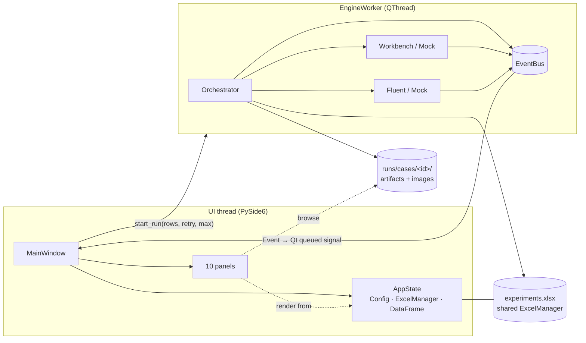

# Slipstream v0.8 — Foundation Design & Implementation Record

**Scope:** convert the terminal-based cfdauto automation into a professional desktop
engineering application. This document is the v0.8 answer to seven questions —
architecture, GUI/UX, module breakdown, engine integration, library choices,
wireframes, and implementation order — and it describes **code that exists and
is tested** (10/10 pytest, including two offscreen GUI smoke tests that run a
full mock batch through the real window).

Non-goals for v0.8 (deliberately deferred, per the master blueprint): AI,
cloud/HPC, plugins, 3D field visualization, SQLite ledger, multi-worker queue,
process-isolated engine. v0.8 is the foundation those versions consume.

---

## 1. Application Architecture

### 1.1 The one rule that shapes everything

> **The GUI is a client of the engine, never its owner.**
> `cfdauto/` still runs headless (`python main.py run`) exactly as before;
> `gui/` may import `cfdauto`, but nothing in `cfdauto/` imports Qt — ever.

v0.8 introduces exactly one new engine concept to make that possible: the
**event bus** (`cfdauto/events.py`). Every interesting pipeline moment is now
published as a typed `Event`; the terminal never sees them (no subscribers),
the GUI subscribes to all of them. This is the miniature of the v0.9 event
protocol from the blueprint — same vocabulary, in-process transport.

### 1.2 Runtime topology



Key mechanics:

* **One workbook instance.** `AppState` owns the `ExcelManager`; the worker
  reuses it. While a batch runs, `AppState.running` locks every schedule
  mutation in one place (`_editable()`), so UI and engine never write
  concurrently.
* **Thread safety by construction.** The bus fires on the worker thread; the
  bridge re-emits through a Qt `Signal(object)` → queued delivery → all slots
  run on the UI thread. No locks in panel code, no `QMetaObject` gymnastics.
* **Live dataset without workbook reads.** During a batch, `case.done/failed`
  events patch the in-memory DataFrame; one authoritative `reload_dataset()`
  happens after the worker finishes.
* **Stop is graceful and resume-safe.** `request_stop()` sets a flag the
  orchestrator polls *between* cases — the current case completes, the Status
  ledger stays consistent, re-running continues where it left off (tested).

### 1.3 Engine changes (complete list — all additive, CLI-compatible)

| Where | Change |
|---|---|
| `cfdauto/events.py` **(new)** | `Event`, `EventBus.subscribe/emit` (thread-safe) |
| `orchestrator.py` | optional `bus`; emits `batch.*`, `case.*`; `run(only_rows=…, should_stop=…)` |
| `fluent_controller.py` | optional `bus`; `stage` events around each phase; `solve.progress` per chunk; `solve.converged/maxiter`; **experimental** `_capture_images()` (contour PNGs, guarded, `fluent.capture_images: false` default) |
| `workbench_controller.py` | optional `bus`; `stage: mesh` + `mesh.ready` |
| `mocks.py` | full event stream incl. streamed convergence + 4 demo contour PNGs per case (dependency-free PNG writer) → whole GUI demos without ANSYS |
| `excel_manager.py` | GUI helpers: `read_row_outputs`, `update_input`, `append_experiment`, `set_status`, `wbp_names` |
| `main.py` | `gui` subcommand (lazy import — CLI stays dependency-free) |

Engine test suite unchanged and green (8/8) after all of the above.

### 1.4 Event vocabulary (authoritative table in `events.py`)

`batch.started` · `case.started` · `stage{mesh,fluent_launch,setup,initialize,
solve,extract × start,done,cached,skip}` · `mesh.ready` · `solve.progress
{it,max_it,cl,cd}` · `solve.converged/maxiter` · `case.done{result}` ·
`case.failed{error}` · `batch.finished{ok,failed,stopped}`. Additive-only.

---

## 2. GUI Layout & User Experience

### 2.1 Shell layout (implemented)

```
┌ Menu: File · Run · View · Help ──────────────────────────────────────────────┐
├ Toolbar: Open · Reload │ ▶ Run All (F5) · ⏹ Stop │ ☐ Mock mode ─────────────┤
├────────────┬──────────────────────────────────────────────┬─────────────────┤
│ EXPLORER   │  ┌ Tabs ────────────────────────────────────┐│ QUEUE ▸ Params  │
│ Project    │  │ Dashboard │ Results │ Charts │ Images    ││ ▶RunAll RunSel  │
│ ⚙ config   │  │                                          ││ ⏹Stop ☐Retry   │
│ ▤ schedule │  │   (central workspace — see §6)           ││ Row AOA V St CL │
│ ⬢ baseline │  │                                          ││  2  0  20 ✓ .20 │
│ Runs       │  │                                          ││  3  0  30 ▶ …   │
│  📁 r002…  │  │                                          │├─────────────────┤
│    case.log│  │                                          ││ MONITOR         │
│    *.png   │  │                                          ││ r003 · 2/8      │
│            │  └──────────────────────────────────────────┘│ [Geo+Mesh▸Flu▸…]│
│  [Refresh] │                                              │ ████████░ 74%   │
│            │                                              │ CL/CD live plot │
├────────────┴─────────── LOG ▸ Statistics (tabbed) ────────┴─────────────────┤
│ 11:39:52 INFO --- Case 2/8: row 3 (AOA=0, V=30) ---            [min: INFO ▾]│
├ engine: case 2/8 — r003_aoa0_v30 · queue: 6 pending · 2 done   v0.8.0 ──────┤
```

Docking uses native `QDockWidget` (tear-off, tabify, View-menu toggles,
Reset-layout action). QtAds upgrade lands in v1.5 per blueprint.

### 2.2 UX conventions (enforced in code)

* **Colour = status, everywhere.** One vocabulary in `theme.STATUS_COLORS`
  drives the queue table, dashboard cards, and pipeline chips.
* **Run-lock.** While a batch runs: run buttons, schedule editing, project
  open/reload, and the mock toggle all disable; Stop enables. One signal
  (`runStateChanged`) fans this out.
* **Inputs of completed rows are read-only** ("inputs locked — already has
  results") — provenance beats convenience.
* **Selection is global.** Selecting a row in Queue/Results/Explorer selects
  the case in Monitor context, Params, and Images (via `AppState.caseSelected`).
* **Nothing blocks.** All engine work in the QThread; the UI stays 60 fps
  during solves. Closing mid-batch asks, then performs a graceful stop.
* **The terminal survives** as the Log console — same formatter, colour-coded,
  level-filterable, bounded scrollback.

---

## 3. Reusable GUI Modules

| Module | Responsibility | Key API |
|---|---|---|
| `gui/theme.py` | palette, QSS, status colours, chart series, pyqtgraph defaults | `apply_theme(app)`, `qcolor()` |
| `gui/state.py` | **single source of truth**: config, shared ExcelManager, DataFrame cache, selection, run-lock | signals `datasetChanged/runStateChanged/caseSelected/projectLoaded`; mutations `update_input/add_experiment/toggle_skip/requeue` |
| `gui/event_bridge.py` | engine↔Qt boundary | `EngineWorker(QThread)` signals `engineEvent/logLine/batchFinished/fatalError`; `QtLogHandler` |
| `gui/widgets/pipeline_widget.py` | painted CFD stage strip (normal+compact) | `set_stage/reset/mark_active_failed` |
| `gui/widgets/cards.py` | dashboard stat card | `set_value` |
| `gui/panels/dashboard.py` | cards, overall progress, pipeline mirror, headline L/D chart, recent-events feed | `handle_event`, `runAllRequested` |
| `gui/panels/explorer.py` | project/runs artifact tree | `imageActivated`, `caseActivated` |
| `gui/panels/queue_panel.py` | schedule table + run controls + context menu (SKIP/re-queue) | `runRequested(rows,retry,max)`, `stopRequested` |
| `gui/panels/monitor.py` | live case: header, pipeline, weighted progress, CL/CD plot | `handle_event` |
| `gui/panels/params_panel.py` | edit selected inputs (AOA/V/WBP), add/duplicate rows | — |
| `gui/panels/results_table.py` | full sortable dataset + CSV export | — |
| `gui/panels/charts_panel.py` | interactive X/Y/colour charts, presets, hover-identify, PNG export | `series_groups()` (shared with dashboard) |
| `gui/panels/stats_panel.py` | descriptive stats, status counts, best-L/D headline | — |
| `gui/panels/images_panel.py` | per-case image thumbnails + zoom/pan preview | `show_file(path)` |
| `gui/panels/log_console.py` | colourised log stream | `append(level,text)` |
| `gui/main_window.py` | assembly, menus/toolbar/statusbar, worker lifecycle, routing | `start_run(...)` |
| `gui/app.py`, `gui_main.py` | entry points (`python main.py gui` / `python gui_main.py`) | `run_app()` |

Reuse pattern proven twice already: `PipelineWidget` (monitor + dashboard) and
`series_groups()` (charts + dashboard).

---

## 4. How Each Module Connects to the Existing Pipeline

```
User clicks Run ─▶ QueuePanel.runRequested ─▶ MainWindow.start_run
      └▶ EngineWorker(cfg, shared ExcelManager, rows/retry/max).start()
             └▶ build_controllers(cfg, bus) ─▶ Orchestrator.run(only_rows,
                                                       should_stop=stop_flag)
Pipeline runs exactly as the CLI did (same code path), emitting Events:
  stage/mesh.ready ──▶ Monitor pipeline chips · Dashboard mini-pipeline
  solve.progress ────▶ Monitor CL/CD curves + progress bar + status bar
  case.started/done/failed ─▶ AppState.apply_event → DataFrame patch
        └▶ datasetChanged ─▶ Queue table · Results · Charts · Stats · Cards
  every log record ──▶ QtLogHandler ─▶ Log console (the old terminal)
batch.finished ─▶ batchFinished signal ─▶ unlock UI, authoritative
                  ExcelManager re-read, Explorer refresh
Artifacts on disk (runs/cases/<id>/…) ─▶ Explorer tree · Images panel
```

Schedule edits go the other way: Params/Queue → `AppState` guard →
`ExcelManager.update_input/append_experiment/set_status` → atomic save →
`reload_dataset()` → every panel refreshes. The engine remains the only
writer of *results*; the GUI is the only writer of *inputs*; the Status
column remains the resume ledger for both.

---

## 5. Library Choices (free, open-source, local-first)

| Need | Chosen | License | Why / rejected alternatives |
|---|---|---|---|
| GUI toolkit | **PySide6-Essentials** | LGPL | Official Qt-for-Python; native docks/tables/menus. *PyQt6* rejected (GPL/commercial). *Electron/Tauri* rejected (second runtime + JS split-brain with a Python engine). *tkinter/CustomTkinter* rejected (can't reach the Workbench/VS bar). |
| Live + interactive plots | **pyqtgraph** | MIT | The only Python lib comfortable with high-rate live updates inside Qt; zoom/pan/hover native; PNG exporter built in. *matplotlib* too slow live (kept possible for print figures later); *Plotly* needs QtWebEngine — deferred to v2.0 analytics per blueprint. |
| Data handling | pandas / openpyxl | BSD/MIT | already engine deps; DataFrame is the panel contract |
| Images | Qt (`QPixmap`, `QGraphicsView`) | LGPL | zero extra deps for browse/zoom/pan |
| Docking | Qt `QDockWidget` | LGPL | zero-dep v0.8; QtAds (LGPL) planned v1.5 |
| Testing | pytest (+ offscreen `QT_QPA_PLATFORM`) | MIT | GUI smoke tests run headless in CI containers |

Install: `pip install -r requirements.txt -r requirements-gui.txt`. The CLI
continues to work with only the first file.

---

## 6. Wireframes

Main shell — see §2.1. Central tabs:

```
DASHBOARD                                   │ RESULTS (tab)
┌ wing_study            [Open][▶ Run All] ┐ │ 8 experiments · 8 completed  [CSV]
│ C:/…/config.yaml · geometry · schedule  │ │ Row AOA V  Status CL    CD    L/D …
├──────┬──────┬──────┬──────┐             │ │  2  0  20 DONE  .1969 .0183 10.78
│ 6    │ 1    │ 1    │ 0    │             │ │  3  0  30 DONE  .1975 .0181 10.90
│Pending Running Done Failed│             │ │ (sortable · row-select syncs all)
├──────┴──────┴──────┴──────┘             │ ├──────────────────────────────────
│ ██████████░░░░░░ 2/8 completed (25%)    │ │ CHARTS (tab)
│ Running r004… (case 3/8)                │ │ X[AOA▾] Y[CL▾] Color[Velocity▾]
│ [Geo+Mesh]→[Fluent]→[Setup]→[Init]→[Sol │ │ [CL vs AOA][Drag polar][L/D vs V]
│ ┌ L/D vs AOA (by velocity) ┐ Recent     │ │        ●──●            [PNG…]
│ │      ●──●──●             │ ✓ r003 CL… │ │    ●──●     ●   hover→ r006_aoa8…
│ │  ●──●        ●──●        │ ▶ r004 sta…│ │ ●──●            AOA=8 CL=0.83
└─┴──────────────────────────┴────────────┘ │ (legend · zoom · pan)
                                            │
IMAGES (tab)                                │ MONITOR (dock)
Case [r002_aoa0_v20 ▾] [Refresh][Folder][Fit] Case 3/8 — r004_aoa4_v30
┌─────────┐ ┌────────────────────────────┐ │ AOA 4° · V 30 m/s
│▦ geometry│ │                            │ │ [✓Geo+Mesh][✓Fluent][✓Setup][✓Init]
│▦ mesh    │ │   (zoomable preview,       │ │ [▶Solve   ][ Extract ]
│▦ pressure│ │    wheel = zoom,           │ │ ████████████░░░░ 74%
│▦ velocity│ │    drag = pan)             │ │ ┌ CL ───────────── CD ┐
└─────────┘ └────────────────────────────┘ │ │      ╭────────────   │ legend
runs/cases/r002…  · 4 image(s)             │ └──────┴───────────────┘ it 400
```

---

## 7. Implementation Order (incremental milestones)

| # | Milestone | Contents | Acceptance | Status |
|---|---|---|---|---|
| M0 | Repo foundation | `slipstream/` tree, gitignore/LICENSE/README, requirements split | clean clone installs; CLI unchanged | ✅ |
| M1 | Engine observability | `events.py`; orchestrator/controllers/mocks emit; `only_rows`/`should_stop`; Excel GUI helpers | 8 engine tests green; CLI byte-identical behaviour | ✅ |
| M2 | Shell skeleton | theme, MainWindow, docks, menus, statusbar, Log console, `EngineWorker` | mock Run All from GUI; logs stream; UI never blocks | ✅ |
| M3 | Queue + Monitor | schedule table w/ run controls & context menu; pipeline strip; progress; live CL/CD | run selected rows; stop-after-case resumes (tested) | ✅ |
| M4 | Dataset views | Results table (sort/CSV), Charts (presets/hover/PNG), Stats, Dashboard cards+chart+feed | after mock batch: 8 points plotted, best-L/D shown | ✅ |
| M5 | Schedule editing | Params panel: edit/add/duplicate/SKIP with run-lock + result-lock | edits persist to xlsx; locked while running | ✅ |
| M6 | Artifacts | Explorer tree; Images panel (thumbs+zoom); mock demo PNGs; open-with-system | double-click image opens in Images tab | ✅ |
| M7 | Real-image capture | `fluent.capture_images` best-effort contours from Fluent | PNGs appear for a real case; never fails a case | ✅ guarded (needs on-machine validation) |
| M8 | Hardening & release | offscreen GUI smoke tests in CI; docs; tag v0.8.0 | `pytest -q` = 10 passed; README quickstart works | ✅ tests/docs · CI file = user's first push |

**v0.8 definition of done:** every checked row above — met. Deferred to v0.9
(by design, see blueprint §21): per-iteration telemetry tap, process-isolated
worker, SQLite ledger, physics linter, `aoa_scale`, packaging (`pyinstaller`).

---

## 8. Running & verifying

```bash
# full experience without ANSYS (mock):
python main.py gui                 # toggle "Mock mode" in toolbar → Run All
# real study (your v261 config already wired):
python main.py gui --config config/config.yaml
# headless CLI — unchanged:
python main.py run --max-cases 1
# tests (engine + offscreen GUI):
python -m pytest tests/ -q        # → 10 passed
```
